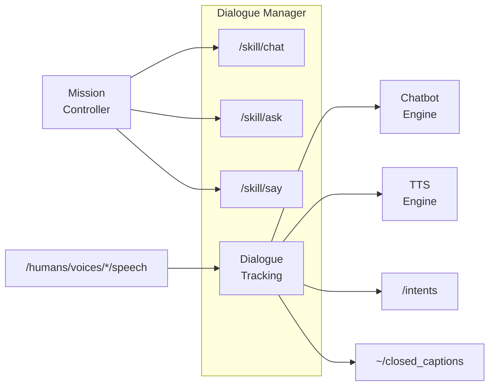

# dialogue_manager

A ROS2 lifecycle node that handles multi-modal communication between the robot and humans.

## Overview

The Dialogue Manager:
- Provides responses to human utterances using an external chatbot backend
- Sends responses to TTS for speech synthesis
- Exposes three high-level skills: `chat`, `ask`, and `say`
- Supports multi-modal expressions with synchronized gestures and expressions
- Persists per-person/per-group conversation history across sessions

See [doc/DIALOGUE_FLOW.md](doc/DIALOGUE_FLOW.md) for the conceptual model
(dialogues, roles, interlocutors, conversations history, current context).




## ROS API

All topics/services exist only in `active` state. Actions exist in both `configured` and `active` states but reject goals in the former.

### Parameters

| Parameter | Type | Default | Description |
|-----------|------|---------|-------------|
| `chatbot` | string | `"chatbot"` | Chatbot node FQN prefix. Empty = disabled |
| `enable_default_chat` | bool | `false` | Enable default chat while active |
| `default_chat_role` | string | `"__default__"` | Role for default chat |
| `default_chat_configuration` | string | `""` | Configuration for default chat |
| `chatbot_startup_timeout` | float | `30.0` | Max wait for chatbot startup (s) |
| `chatbot_response_timeout` | float | `5.0` | Max wait for chatbot response (s) |
| `multi_modal_expression_timeout` | float | `60.0` | Max expression duration (s) |
| `markup_action_timeout` | float | `10.0` | Default markup action timeout (s) |
| `markup_libraries` | string[] | `["config/00-default_actions.yaml"]` | Markup definition files |
| `disabled_markup_actions` | string[] | `["motion"]` | Markup actions to skip |
| `conversations_storage_dir` | string | `"~/.ros/dialogue_manager/conversations"` | Where per-person/group histories are persisted (empty = in-memory only) |

### Topics

#### Subscribed

| Topic | Type | Description |
|-------|------|-------------|
| `/humans/voices/tracked` | `hri_msgs/IdsList` | Tracked voice IDs |
| `/humans/voices/<id>/speech` | `hri_msgs/LiveSpeech` | User speech input |

#### Published

| Topic | Type | Description |
|-------|------|-------------|
| `~/closed_captions` | `hri_actions_msgs/ClosedCaption` | Captions for all speech |
| `~/robot_speech` | `std_msgs/String` | Current word being spoken |
| `~/currently_waiting_for_chatbot_response` | `std_msgs/Bool` | True while waiting for chatbot |
| `/intents` | `hri_actions_msgs/Intent` | Detected intents |
| `/diagnostics` | `diagnostic_msgs/DiagnosticArray` | Node diagnostics |

### Action Servers


| Action | Interface | Description |
|--------|-----------|-------------|
| `/skill/chat` | `communication_skills/Chat` | Start dialogue with defined role |
| `/skill/ask` | `communication_skills/Ask` | Ask question and get structured answers |
| `/skill/say` | `communication_skills/Say` | Speak multi-modal expression |

**Priority handling:** Goals are rejected if `meta.priority` ≤ any ongoing dialogue or expression.

### Action Clients

| Action | Interface | Description |
|--------|-----------|-------------|
| `<chatbot>/start_dialogue` | `chatbot_msgs/Dialogue` | Open dialogue channel |
| `tts_engine/tts` | `tts_msgs/TTS` | Text-to-speech |

### Service Clients

| Service | Interface | Description |
|---------|-----------|-------------|
| `<chatbot>/dialogue_interaction` | `chatbot_msgs/DialogueInteraction` | Send input, get response |

## Conversations history

Past dialogues are archived per-person and per-group under
`conversations_storage_dir` (one JSON file per interlocutor, loaded on
configure and saved on shutdown). When a new dialogue starts, the
relevant history is built into a context string and pushed to the
chatbot as a `__system__` priming message.

ASK-role dialogues are excluded from the context by default. Older
dialogues can be replaced by an LLM-generated summary; summaries are
cached on the dialogue and persisted, so the LLM is not re-queried per
turn. See [doc/DIALOGUE_FLOW.md](doc/DIALOGUE_FLOW.md) for the model and
[TODO.md](TODO.md) for known follow-ups (context-delivery redesign,
pyhri groups).

## Multi-modal expression markup

The `/skill/say` action and chatbot responses support a markup language
that synchronizes TTS with robot actions (facial expressions, gestures,
LED effects, gaze). For example:

```
<set expression(happy)> <start motion(wave)> Hello! <wait motion timeout=1> <set expression(neutral)>
```

This will make the robot say "Hello!" while waving with a happy
expression, wait for the wave to finish (up to 1 second), then return to
a neutral expression.

See [doc/TEXT_MARKUP.md](doc/TEXT_MARKUP.md) for the full specification,
including verb semantics, available actions, variable substitution, and
the built-in `<pause(N)>` action.

Available actions are defined in `config/00-default_actions.yaml` and can
be extended by adding YAML files to the `markup_libraries` parameter.
Individual actions can be disabled via `disabled_markup_actions` (e.g.
`motion` is disabled by default for safety).

## Launch

```bash
ros2 launch dialogue_manager dialogue_manager.launch.py
```


