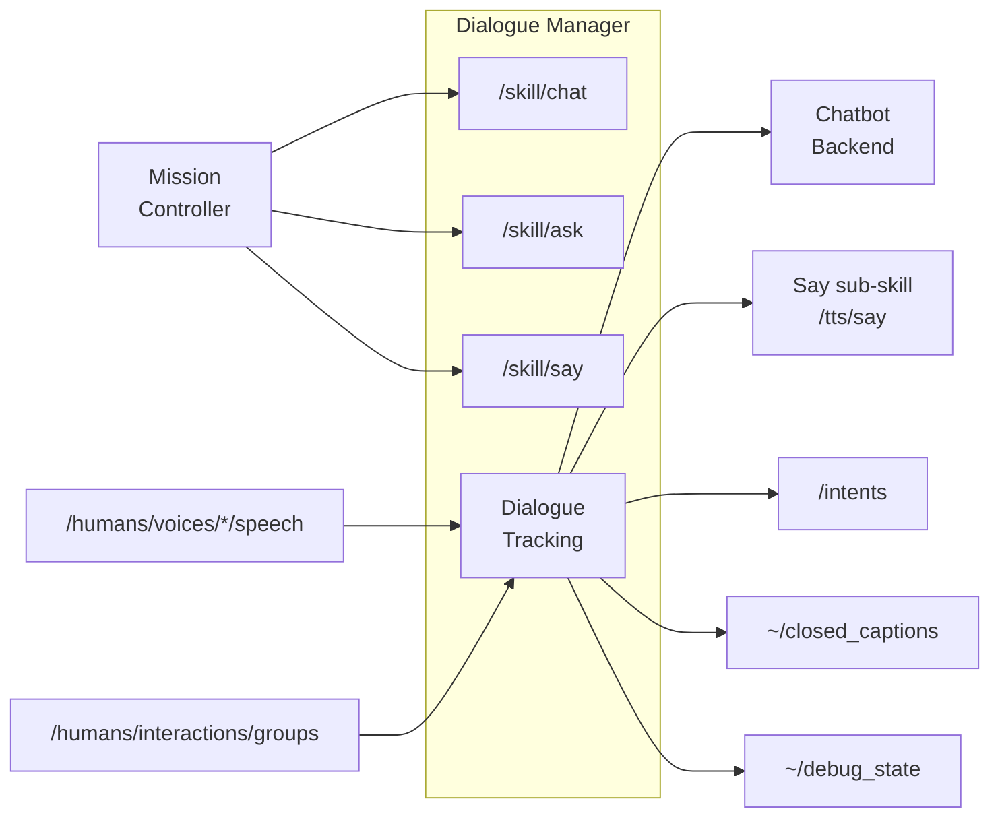

# dialogue_manager

A ROS2 lifecycle node that handles multi-modal communication between
the robot and humans.

## Overview

The Dialogue Manager:
- Tracks every conversation the robot is engaged in — per person and
  per ROS4HRI group — including a chronological history of utterances
  and pre-filled context from prior sessions.
- Optionally consults an external chatbot backend (e.g. an LLM) to
  generate responses; works without one, emitting `RAW_USER_INPUT`
  intents for a controlling script to handle.
- Speaks via a Say sub-skill (`/tts/say` by default), with markup
  supporting synchronised gestures, expressions, and LED effects.
- Exposes three high-level skills: `/skill/chat`, `/skill/ask`,
  `/skill/say`.
- Persists per-interlocutor history to disk and pre-fills new sessions
  with the most recent summary so the robot can pick up where it left
  off.
- Publishes a JSON debug snapshot on `~/debug_state` for live
  introspection via the [`rqt_dialogues`](../rqt_dialogues) plugin.

See [doc/DIALOGUE_FLOW.md](doc/DIALOGUE_FLOW.md) for the conceptual
model and end-to-end flow.



## ROS API

All topics/services exist only in `active` state. Actions exist in
both `configured` and `active` states but reject goals in the former.

### Parameters

| Parameter | Type | Default | Description |
|-----------|------|---------|-------------|
| `chatbot` | string | `"chatbot"` | Chatbot node FQN prefix. Empty = disabled (passive history-only mode). |
| `say_action` | string | `"/tts/say"` | Action name of the Say sub-skill (the TTS frontend). |
| `enable_default_chat` | bool | `false` | When true, auto-spawn a per-person `__default__` dialogue on first utterance from a tracked voice. |
| `default_chat_role` | string | `"__default__"` | Role for auto-spawned default dialogues. |
| `default_chat_configuration` | string | `""` | Role configuration JSON for auto-spawned default dialogues. |
| `chatbot_startup_timeout` | float | `30.0` | Max wait for chatbot startup (s). |
| `chatbot_response_timeout` | float | `5.0` | Max wait for chatbot response (s). |
| `multi_modal_expression_timeout` | float | `60.0` | Max expression duration (s). |
| `markup_action_timeout` | float | `10.0` | Default markup action timeout (s). |
| `markup_libraries` | string[] | `["config/00-default_actions.yaml"]` | Markup definition files. |
| `disabled_markup_actions` | string[] | `["motion"]` | Markup actions to skip. |
| `conversations_storage_dir` | string | `"~/.ros/dialogue_manager/conversations"` | Where per-person/group histories are persisted (empty = in-memory only). |
| `planner_dialogue_act_topic` | string | `"/planner/dialogue_act"` | Planner-owned asynchronous dialogue-act topic. |
| `planner_dialogue_wording_mode` | string | `"chatbot"` | `chatbot` routes planner wording through `chatbot_llm`; `direct` speaks planner text directly. |
| `planner_completion_wording_mode` | string | `"chatbot"` | Compatibility override for `notify_completion` when global planner wording mode is `direct`. |
| `planner_dialogue_dedupe_window_sec` | float | `1.5` | Duplicate planner act suppression window (seconds). Set `<= 0` to disable dedupe. |
| `use_llm_completion_wording` | bool | `false` | Legacy completion-wording override. Prefer `planner_completion_wording_mode`. |

### Topics

#### Subscribed

| Topic | Type | Description |
|-------|------|-------------|
| `/humans/voices/tracked` | `hri_msgs/IdsList` | Tracked voice IDs (TRANSIENT_LOCAL). |
| `/humans/voices/<id>/speech` | `hri_msgs/LiveSpeech` | User speech input per voice. |
| `/humans/interactions/groups` | `hri_msgs/Group` | Group membership (TRANSIENT_LOCAL); empty `members` signals dispersal. |
| `/planner/dialogue_act` (configurable) | `std_msgs/String` | Planner dialogue-act seam consumed by Dialogue Manager. Live stack may relay through `nao_orchestrator`. |

#### Published

| Topic | Type | Description |
|-------|------|-------------|
| `~/closed_captions` | `hri_actions_msgs/ClosedCaption` | Captions for all speech (user + robot). |
| `~/robot_speech` | `std_msgs/String` | Current word being spoken (per-word Say feedback). |
| `~/currently_waiting_for_chatbot_response` | `std_msgs/Bool` | True while waiting for chatbot. |
| `~/debug_state` | `std_msgs/String` | JSON snapshot of internal state (TRANSIENT_LOCAL, on-change). |
| `/intents` | `hri_actions_msgs/Intent` | Detected intents (including `RAW_USER_INPUT`). |
| `/diagnostics` | `diagnostic_msgs/DiagnosticArray` | Node diagnostics. |

### Action Servers

| Action | Interface | Description |
|--------|-----------|-------------|
| `/skill/chat` | `communication_skills/Chat` | Start a long-lived dialogue with a defined role. |
| `/skill/ask` | `communication_skills/Ask` | Ask a question and capture the answer. |
| `/skill/say` | `communication_skills/Say` | Speak a multi-modal expression. |

**Priority handling.** Chat/Ask and Say compete on different channels:
- **Chat / Ask** (new dialogue): rejected if `priority ≤ highest
  active dialogue priority`. Strict preemption — a new dialogue must
  outrank existing ones.
- **Say** (one-shot expression): rejected if `priority < current
  expression priority`. Cooperative — a Say can speak alongside any
  active dialogue and preempts an in-flight expression of equal or
  lower priority.

### Action Clients

| Action | Interface | Description |
|--------|-----------|-------------|
| `<say_action>` (default `/tts/say`) | `communication_skills/Say` | Speak markup-stripped text. |

### Service Clients

| Service | Interface | Description |
|---------|-----------|-------------|
| `<chatbot>/prepare_dialogue` | `chatbot_msgs/PrepareDialogue` | Optional chatbot warm-up when a dialogue is created. |
| `<chatbot>/dialogue_interaction` | `chatbot_msgs/DialogueInteraction` | Send input, get response. |
| `<chatbot>/summarize` | (optional) | Used when present to LLM-summarise old dialogues at session end. |

## Conversations history

Past dialogues are archived per-person and per-group under
`conversations_storage_dir` (one JSON file per interlocutor, loaded
on configure, saved periodically and on shutdown). Group dialogues
are also fanned out into each member's personal history.

When a new dialogue spawns for a known interlocutor, the most recent
prior summary is pre-filled at the top of the new dialogue's
history (marked with a `__summary__` utterance plus a
`__session_break__`), so the robot picks up with prior context.

See [doc/DIALOGUE_FLOW.md](doc/DIALOGUE_FLOW.md) for the recording
fan-out rules, summariser model, and pre-fill semantics.

## Multi-modal expression markup

The `/skill/say` action and chatbot responses support a markup
language that synchronises speech with robot actions (facial
expressions, gestures, LED effects, gaze). For example:

```
<set expression(happy)> <start motion(wave)> Hello! <wait motion timeout=1> <set expression(neutral)>
```

The robot says "Hello!" while waving with a happy expression, waits
for the wave to finish (up to 1 second), then returns to neutral.

See [doc/TEXT_MARKUP.md](doc/TEXT_MARKUP.md) for the full
specification (verb semantics, available actions, variable
substitution, the built-in `<pause(N)>` action).

Actions are defined in `config/00-default_actions.yaml` and can be
extended via additional YAML files listed in `markup_libraries`.
Individual actions can be disabled via `disabled_markup_actions`
(e.g. `motion` is disabled by default for safety).

## Live introspection

The `rqt_dialogues` plugin (sibling package in the same repo)
subscribes to `~/debug_state` and shows a live two-pane view of
active and archived dialogues with their full history. Boxes flash
to highlight recently-updated dialogues. Useful when tuning
default-chat behaviour or debugging group fan-out.

## Launch

```bash
ros2 launch dialogue_manager dialogue_manager.launch.py
```

Then drive the lifecycle:

```bash
ros2 lifecycle set /dialogue_manager configure
ros2 lifecycle set /dialogue_manager activate
```
